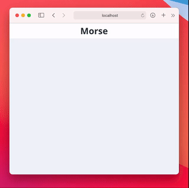

# Morse

<p align="center">
  
</p>

A simple web app for learning morse code. Supports text-to-morse and
morse-to-text. Written in TypeScript, using React.

Works well on a computer or a mobile device.

## Development

```shell
# Install dependencies
yarn install

# Run the development server
yarn run dev
```

## Resources

- https://morsecode.world/international/timing.html
